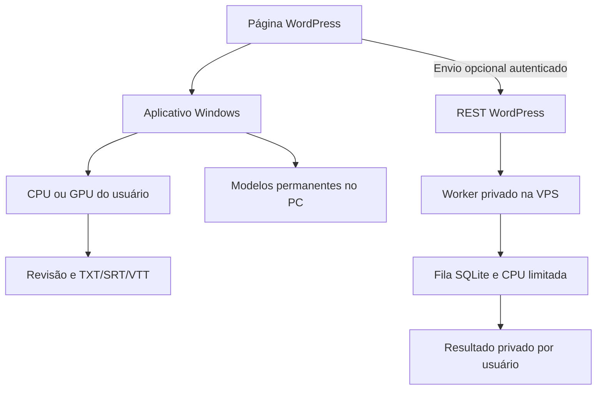

# Transcriber Pro 3

Base funcional com **processamento local prioritário**: aplicativo Windows independente + plugin WordPress + worker opcional na VPS. Substitui o `transcriberpro3.php` vazio do commit `883b3a8`.

## Uso pelo usuário

1. Na página WordPress, baixe o pacote Windows disponibilizado pelo administrador.
2. Extraia **toda a pasta** e abra `TranscriberPro3.exe`. O pacote inclui Python; o usuário não instala Python, pip ou FFmpeg.
3. Selecione áudio/vídeo, modelo e transcreva no PC. Revise e exporte TXT, SRT e VTT.
4. No primeiro uso de cada modelo há download direto do Hugging Face. Nas próximas transcrições a cópia é verificada e reutilizada, inclusive offline.
5. Se não puder usar o aplicativo, usuários autorizados podem abrir a opção do servidor e enviar o arquivo conscientemente.

**O navegador não instala nem executa Whisper sozinho.** A integração local desta versão é um fluxo de download e abertura do aplicativo nativo; não há detecção automática do aplicativo, acesso do site ao disco ou envio automático do resultado para WordPress. Isso evita depender de localhost, extensões ou permissões especiais do navegador.

## Arquitetura



| Parte | Localização | Responsabilidade |
|---|---|---|
| Plugin WordPress | `transcriberpro3.php`, `assets/` | Shortcode, download do app e proxy autenticado |
| Aplicativo Windows | `desktop/main.py` | Interface Tk, revisão, histórico e exportação |
| Motor compartilhado | `tp3/` | Modelos, hashes, Whisper e formatos |
| Worker VPS | `server/app.py` | Fila persistente, um trabalho por vez, isolamento por usuário |
| Empacotamento | `scripts/`, `.github/workflows/ci.yml` | ZIP do plugin e build nativo Windows |
| Implantação | `deploy/`, `docs/` | systemd, Nginx, PHP, instalação e validação |

WordPress mantém suas contas e permissões no banco atual. A fila usa SQLite **fora do diretório público**, sem alterar tabelas do site. O worker escuta apenas em `127.0.0.1:8766`; não é publicado pelo Nginx.

## Modelos e cache

Caminho Windows: `%LOCALAPPDATA%\TranscritorLocalPro\modelos\<modelo>`. O histórico fica em `...\historico`.

Modelos: `tiny`, `base`, `small`, `medium`, `large-v3-turbo` (CTranslate2). Revisões do upstream estão fixadas no código. Downloads usam os hashes publicados pelo Hugging Face: SHA-256 para pesos LFS e Git SHA-1 para arquivos pequenos. O manifesto local preserva esses hashes, e cada uso verifica todos os arquivos antes de carregar. Cache válido não consulta a rede. Arquivos ausentes ou corrompidos são baixados/reparados; os demais são preservados. Download incompleto não é promovido a arquivo validado. Atualizar o programa não apaga os modelos.

O cache não é uma proteção contra um administrador local malicioso que altere pesos e manifesto juntos. Não coloque a pasta de modelos em diretório compartilhado gravável por terceiros. A verificação completa de modelos grandes acrescenta leitura de disco antes de iniciar.

## Início para desenvolvimento

Python 3.11 x64 é o alvo de distribuição. Python é necessário para **desenvolver/construir**, não para usar o ZIP Windows.

```bash
python -m venv .venv
# Linux/macOS: source .venv/bin/activate
# Windows: .venv\Scripts\Activate.ps1
python -m pip install -r requirements-dev.txt
python -m pytest -q
python -m desktop.main
```

- [Build e uso no Windows](docs/WINDOWS.md)
- [Implantação WordPress + Nginx + worker](docs/VPS.md)
- [Validação efetiva e testes pendentes](docs/VALIDATION.md)
- [Dependências e redistribuição](THIRD_PARTY.md)

A automação GitHub Actions produz os artefatos `wordpress-plugin` e `TranscriberPro3-windows-x64`. Build aprovado não equivale a homologação em Windows 10/11 do usuário. Publique o ZIP testado em uma Release e configure sua URL no WordPress.

## Limites desta base

- Idioma de transcrição: português; GPU NVIDIA compatível é opcional, CPU é o caminho de compatibilidade. A VPS usa somente CPU.
- Cancelamento cooperativo entre segmentos e arquivos de download; não interrompe instantaneamente uma chamada nativa em execução.
- Na VPS, trabalhos interrompidos por reinício são recolocados na fila e recomeçam do início. Não há retomada por timestamp. O aplicativo desktop salva resultados completos no histórico; não recupera uma transcrição parcial após encerrar o processo.
- Revisões TXT/SRT/VTT são independentes; editar TXT não recalcula legendas. Salve as abas revisadas; o histórico automático guarda a saída original.
- Fila: até 8 trabalhos ativos no total, 1 por usuário e 10 submissões por hora por usuário. Upload: 100 MiB. Resultados expiram em 24h na configuração padrão; áudios são removidos ao terminar, falhar ou cancelar.
- Não inclui cobrança, créditos, multi-GPU, diarização, assinatura Authenticode ou instalador MSI. Entrega portátil em pasta/ZIP, empacotável sem Python no destino.
- A fila e os modelos da VPS pertencem ao serviço; não são os modelos do PC do visitante.
